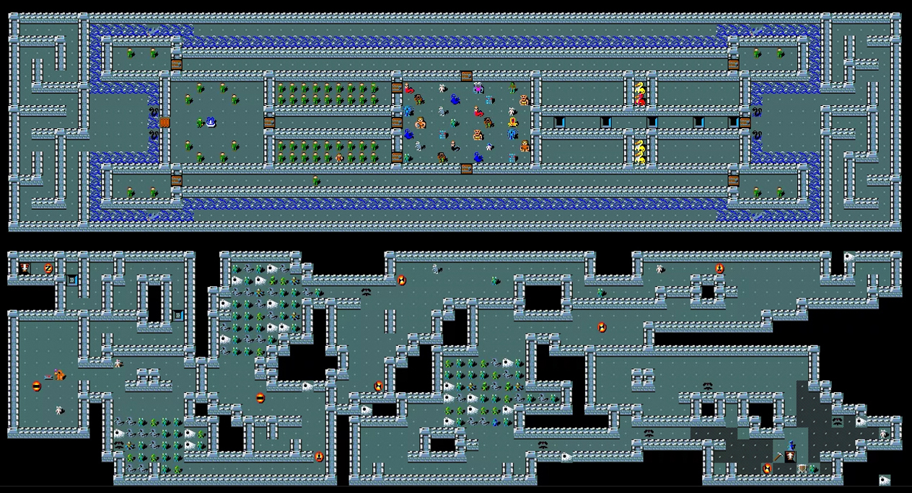
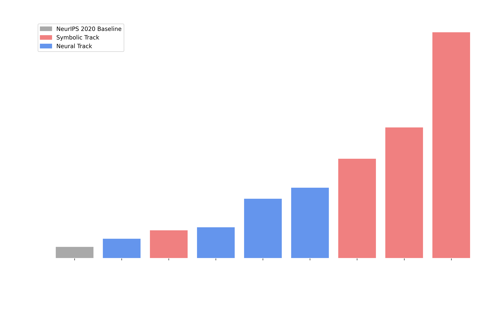

At the start of June, we [announced the NetHack Challenge 2021](https://ai.facebook.com/blog/launching-the-nethack-challenge-at-neurips-2021/), hosted at NeurIPS 2021, as a partnership between Facebook (now Meta) AI Research, AI Crowd, Oxford, UCL, and NYU. We furthermore were supported by our sponsors, Meta AI, and DeepMind. [In this challenge](https://www.aicrowd.com/challenges/neurips-2021-the-nethack-challenge), we set out the goal to beat NetHack using any method you want (within the bounds of compute/time restrictions at test time) or --- failing that --- get as high an in-game score as possible. The competition has ended, and in this post, we will present and discuss the results, having first briefly recapped why this challenge matters for AI research, and what the rules and stakes were.

## Why we organized the NetHack Challenge
NetHack (originally released in 1987 but still actively developed) is one of the oldest and most popular [rogue-like games](https://en.wikipedia.org/wiki/Roguelike) as well as [one of the hardest video games in existence](https://www.telegraph.co.uk/gaming/what-to-play/the-15-hardest-video-games-ever/nethack/). At NeurIPS 2020, researchers from Facebook AI Research, UCL, NYU, and Oxford presented the [NetHack Learning Environment (NLE)](https://arxiv.org/abs/2006.13760) as a fast-but-complex RL environment based on NetHack, together with a baseline RL agent based on [TorchBeast](https://github.com/facebookresearch/torchbeast). However, despite the use of competitive (at the time) algorithms and bountiful compute, the benchmark agent presented as part of the release remained many orders of magnitude away from expert human performance on NetHack. This significant gap served to show that NetHack presents a new frontier for RL research, calling for new ways of incorporating external knowledge, human intuition, and of developing abstractions which would permit the efficient reuse of experience from previous games in order to better tackle a substantial challenge in an ever-changing world.

As a result of the need for novel methods, and a desire to include the wider community into this exciting research agenda, we proposed the [NeurIPS 2021 NetHack Challenge](https://nethackchallenge.com), inviting teams to design and evaluate agents against the full, unrestricted game of NetHack. We imposed no limits upon how teams would design or train (if relevant) their agents, with the hope of witnessing the creative thinking our research community often displays, but also with the hope  of providing suitable grounds for the head-to-head comparison of symbolic systems and deep learning, as NetHack has a talented community of bot-makers we hoped to attract. Would Deep RL methods win the day, as some might expect they would, given the recent success of this class of methods? Would contestants come up with novel adaptations of state of the art methods, and show us that completion of the full game already lies within our grasp? We shall find out below!

## How was this competition run?
The rules of the challenge were simple: contestants were to design agents using any means and resources they wanted, with the proviso that the agent could only interact with the environment through the NetHack Learning Environment API, that it would need to complete a number of games with initial random conditions (e.g. character race, class, random seed) controlled by the organizers, and that it would need to complete individual runs within particular time and resource constraints imposed by AICrowd. Agents are ranked based on the mean number of ascensions (winning the game), or if tied (e.g., if no agent wins the game once), by median in-game score across the allotted test runs.

Each team could submit one agent for the test phase. All agents would be run using the same evaluation protocol, and ranked in up to four leaderboards:
General ranking (all agents)
Agents not using machine learning (e.g., symbolic/heuristic/rule-based agents, or ‘bots’)
Agents using machine learning (e.g., Deep Reinforcement Learning)
Non-industry teams (e.g., academic/independent researchers)
Given that two of these leaderboards are mutually exclusive, a team could potentially top up to three leaderboards at most.

Prize money had been made available, thanks for our Sponsors, Meta AI and DeepMind. The teams of top ranking eligible entries (see rules 11 and 12) on each leaderboard are to be awarded $3,000 for the best eligible entry, and $2,000 for the best runner up.

## Show me the results!

--------------

#### Best Agent Not Making Use of a Neural Network (Symbolic): 

* **Winners - Team AutoAscend**
* Runners Up - Team Students of Stone

#### Best Agent Making Significant Use of a Neural Network (Neural): 

* **Winners - Team RAPH**
* Runners Up - Team Kakao Brain NetHack 

#### Best Agent From Independent/Academic Lab: 

* **Winners - Team AutoAscend**
* Runners Up - Team Students of Stone 

#### Best Overall Agent: 

* **Winners - Team AutoAscend**
* Runners Up - Team Students of Stone 

[Full Leaderboard Results](https://www.aicrowd.com/challenges/neurips-2021-the-nethack-challenge/leaderboards?challenge_leaderboard_extra_id=972&challenge_round_id=911)

----------------

The results of the showdown showed that --- for the time being --- symbolic bots (red) quite clearly have the upper hand in this difficult environment.  

The top three spots in the Overall Best Agent all went to agents from the Symbolic Agent Track. Then the following three went to top of the Neural Agents track, with the winner of this track being the only highly hybrised model in the competition, alternating between symbolic and neural play depending on the proximity of monsters. 

The margin of victory was significant, with the top symbolic agent beating the top neural agent by a factor of almost 3 in the median score. This was, in fact, increased when looking at the very best agents from each team, where frequently we might see almost an order of magnitude improvement in the median score between the best symbolic and neural agents. 

While our best symbolic teams had moderate-to-expert NetHack domain understanding, we were surprised to find they often had extensive ML experience as well. In fact, both winning symbolic teams said they had intended to enter the neural track, but found their symbolic methods scaled much better.

In over half a million evaluation games, no agent managed to ascend. 

## What does it all mean for AI?

> "Despite the game of NetHack being far from solved by these agents, seeing them descend over 20 levels deep into the dungeons of NetHack to achieve scores of over 100,000 points is very encouraging!  Past versions of NetHack have a rich history of symbolic-agent-type bots, so the methods of machine learning may have some catching up to do in this specific realm of playing NetHack, but I am optimistic for the future of both methods after seeing the results of the challenge.  It has been amazing to see a game that I cherish so dearly be used to make new advancements in machine learning and artificial intelligence, and I look forward to seeing how teams improve in next year's challenge!"

> -- [ToneHack](https://tonehack.net/about/)

#### NetHack is far from solved. 
First of all the results show that NetHack is still a tremendously hard challenge for AI agents, whether they are symbolic bots or deep reinforcement learning agents. The top median score of ~5,000 is several orders of magnitude short of typical human ascensions, and while some bots managed to achieve much higher scores in a few limited runs, most runs did not descend very deep into the dungeons of NetHack and instead stayed within early stages of the game.

#### Median score is good --- but ascensions would be better.
The challenge highlighted the complex relationship between score and ascension. We found many entrants elected to “camp” in the early stages of the dungeon, grinding out a high score by killing monsters, instead of progressing into the dungeon. While this undoubtedly helped the weakest ‘roles’ in the game, like Tourist or Healer, it will not lead to winning the game. We learnt that score and ascensions are not always well-aligned, and our objective may be due a rethink in future challenges. That said, the focus on the median agent performance is still important, incentivising the creation of robust, general agents; but the focus on in-game score may be less so.

#### Symbolic bots can strategize like a human; Can neural ones?
NetHack benefits ‘strategic’ play --- good play often involves executing a series of actions with a well-defined, expressible sub-objective, eg: “Find Sokoban” or “Apply a Unicorn Horn to Cure Poison”. Symbolic bots found it easy to define ‘strategy’-like subroutines and to decide when to deploy them based on rich, human-legible representations of the game state. This made it easy for participants developing symbolic bots to incorporate their domain knowledge. Neural agents struggle in this area, since hierarchical RL is an open problem in the research field, and it is hard for agents to discover ‘strategy’-type patterns of behaviour in environments featuring such a large action space and sparse reward.

#### Symbolic bots can be know-it-alls; Neural agents find it harder.
The game of NetHack is only partially observable. Only a single dungeon-level is ever visible, and the many objects and player states are often hidden unless inspected. Remembering a discovery, or incorporating extra knowledge is often key to making a good decision.

Symbolic bots excelled in keeping the full game state in memory, and incorporating external knowledge into their strategies. They found it easy to transfer domain knowledge to the decision-making process. In contrast, neural agents find it harder to maintain information in memory, especially if there is no reward directly associated with it.

#### Open Challenges to Deep Learning
While we saw some impressive results for Deep Reinforcement Learning, including an improvement of almost 5x on top of our IMPALA baseline, we think the challenge highlighted some key areas for improvement. How can deep learning deal with a sparse or misaligned reward? We repeatedly saw reward shaping as a means of biasing useful behaviours --- how can we learn skills without constantly adding rewards? How can we use hierarchical actions or strategies? What is the best way to learn strategies/subroutines? How can we deploy these and trade them off? How can we better incorporate human behaviours and knowledge into our decision making algorithms? Can we learn from human demonstrations (e.g., games on [alt.org](https://alt.org/nethack/)) or even natural language advice from the [NetHack Wiki](https://nethackwiki.com/wiki/Main_Page)?

## What’s next?
While the Challenge has demonstrated significant community-driven progress with almost a five-fold improvement over our IMPALA baseline in a deep reinforcement learning approach alone, NetHack is still far away from being solved via machine learning based (or even symbolic) approaches. To wrap up the NetHack Challenge, we will write a joint report, summarizing the main findings.

We believe this challenge marks the beginning of an exciting series of competitions: the game remains unsolved, and it is to be seen whether symbolic bots will be able to scale to the point of reliably beating the game. Future challenges will need to focus on refining evaluation metrics, such that the ranking of agents better reflects progress in the game. As alluded to above, future challenges may also seek to proactively encourage teams to exploit external knowledge such as the NetHack Wiki, or recordings of human play.

In the meantime, check out [The NetHack Learning Environment](https://github.com/facebookresearch/nle) and [MiniHack](https://github.com/facebookresearch/minihack) on GitHub if you want to start training your own deep Reinforcement Learning agents in NetHack. We hope you enjoyed the challenge! 

### Sponsors
We thank Meta AI and DeepMind for sponsoring this challenge, and for their support.

